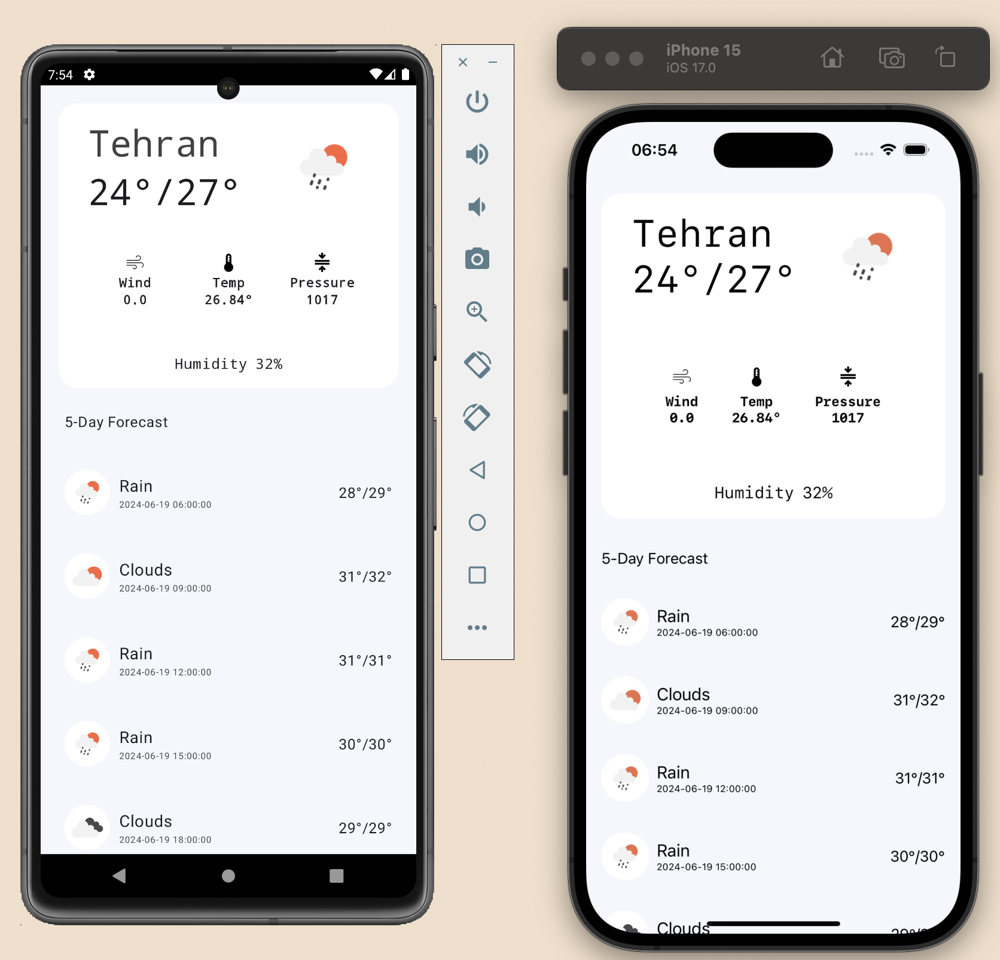

## سورس کد آموزش کاتلین مالتی پلتفورم با ساخت اپلیکیشن آب و هوا برای Android و iOS

با انتشار هر قسمت از آموزش در کانال یوتیوب، repository آپدیت میشود.

### مطالبی که تو این دوره یاد میگیریم:

۱- آماده سازی محیط توسعه و آشنایی با ساختار Kotlin Multiplatform

۲- نحوه اتصال به سرور با استفاده از Ktor

۳- پیاده سازی dependency injection با استفاده از koin

۴- اشتراک گذاری منابع مثل تصاویر، متن ها و ... بین اندروید و iOS

۵- رفع محدودیت ها Kotlin Native و استفاده از Coroutine ها در Swift

۶- کمی هم با SwiftUI آشنا میشیم

[کانال](https://www.youtube.com/channel/UCVpCDOwpvRHE_rrssLp_e-g)

[پلی لیست دوره](https://www.youtube.com/playlist?list=PLbSjprX0Z6sabW7oYRmXJvUjHOpW7Vf94)

